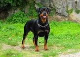

# Dog Breed 🐶 Classification with Docker Compose 🐳 and PyTorch Lightning ⚡ 

This project demonstrates how to set up training, evaluation, and inference for dog breed classification using Docker and PyTorch Lightning. The project uses Docker containers for environment consistency and [PyTorch Lightning](https://lightning.ai/docs/pytorch/stable/) for modular training, evaluation, and inference. It utilizes the [Kaggle Dog Breed dataset](https://www.kaggle.com/datasets/khushikhushikhushi/dog-breed-image-dataset), managed using Docker Compose.

## Table of Contents
- [Requirements](#Requirements-)
- [Dataset](#dataset-)
- [PyTorch Lightning Module](#pytorch-lightning-module-)
  - [Why PyTorch Lightning?](#why-pytorch-lightning-)
- [Docker Setup](#docker-setup-)
  - [DevContainer](#devcontainer-)
  - [Docker Compose Services](#docker-compose-services-)
- [Training and Evaluation](#training-and-evaluation-)
- [Inference](#inference-)
- [Running Docker Containers](#running-docker-containers-)
- [Results](#results-)
- [References](#references-)

## Requirements 📦

The project requires the following packages to be installed:

- `PyTorch`
- `torchvision`
- `PyTorch Lightning`
- `NumPy`
- `gdown`
- `scikit-learn`
- `timm`
- `TensorBoard`
- `Matplotlib`

## Dataset 📂

The dataset used for this project is the [Dog Breed Image Dataset](https://www.kaggle.com/datasets/khushikhushikhushi/dog-breed-image-dataset). This dataset consists of images for 10 dog breeds, organized for computer vision tasks like image classification. The breeds included are: 👇


<table>
  <tr>
    <td><b>Golden Retriever</b></td>
    <td><b>German Shepherd</b></td>
    <td><b>Labrador Retriever</b></td>
    <td><b>Bulldog</b></td>
    <td><b>Beagle</b></td>
  </tr>
  <tr>
    <td><b>Poodle</b></td>
    <td><b>Rottweiler</b></td>
    <td><b>Yorkshire Terrier</b></td>
    <td><b>Boxer</b></td>
    <td><b>Dachshund</b></td>
  </tr>
</table>

Each breed has 100 images stored in separate directories, ensuring diversity and relevance for effective training and evaluation of machine learning models.

## PyTorch Lightning Module ⚡

PyTorch Lightning is a lightweight wrapper around PyTorch that simplifies the process of building and training neural networks. It promotes best practices by organizing code into modular components, enabling developers to focus on the logic of their models rather than boilerplate code. Here are some reasons to use PyTorch Lightning and what it offers:

### Why PyTorch Lightning?

✅ **Simplified Code Structure:** By separating the research code from engineering concerns, it encourages clean and organized code, making it easier to maintain and scale.

✅ **Flexibility:** It provides an easy way to switch between different training strategies (like multi-GPU training, TPU support, etc.) with minimal changes to the codebase.

✅ **Built-in Features:** Lightning includes built-in logging, checkpointing, and early stopping mechanisms, reducing the need for manual implementations.


## Docker Setup 🐳

### DevContainer

The `.devcontainer` setup allows you to develop in a pre-configured environment using VS Code:

```json
{
  "name": "Dog Breed Classification",
  "dockerFile": "Dockerfile",
  "settings": {
    "terminal.integrated.shell.linux": "/bin/bash"
  },
  "extensions": [
    "ms-python.python",
    "ms-azuretools.vscode-docker"
  ],
  "postCreateCommand": "pip install -r requirements.txt"
}
```

### Docker Compose Services

The Docker Compose file defines three services: `train`, `evaluate`, and `infer`:

```yaml
version: '3.8'

services:
  train:
    # Train service
    build:
      context: .
      dockerfile: Dockerfile.train
    shm_size: "2gb"
    volumes:
      - host:/opt/mount
      - ./model:/opt/mount/model
      - ./data:/opt/mount/data

  evaluate:
    # Evaluate service
    build:
      context: .
      dockerfile: Dockerfile.eval
    volumes:
      - host:/opt/mount
      - ./model:/opt/mount/model
      - ./data:/opt/mount/data

  infer:
    # Inference service
    build:
      context: .
      dockerfile: Dockerfile.infer
    volumes:
      - host:/opt/mount
      - ./data:/opt/mount/data
      - ./predictions:/opt/mount/results

volumes:
  host:
```

## Training and Evaluation

To set up and execute the training, evaluation, and inference processes, follow these steps:

1️⃣ **Build Docker Images**: 

- First, build the Docker images for all services using the following command:

   ```bash
   docker compose build
   ```

- This command prepares the environment by ensuring that all necessary dependencies are installed and the code is packaged correctly.

2️⃣ **Train the Model**: 

- To train the model, run:

   ```bash
   docker compose run train
   ```

- This command utilizes the Lightning `DogClassifier` to train the model and saves the checkpoints to the shared volume.

3️⃣ **Evaluate the Model**: 

- To evaluate the model using the saved checkpoint, execute:

   ```bash
   docker compose run evaluate
   ```

- This command loads the model from the checkpoint and prints validation metrics using `eval.py`.

## Inference 🔍

- To run inference on sample 10 images and see the predicted dog breeds, use:

```bash
docker compose run infer
```

- The `infer.py` script will utilize the trained model to predict the labels for 10 random images and save the output to the `predictions` directory.

One thing to note here is that Each service employs **volume mounts** to ensure that data, checkpoints, and results are accessible across different containers, maintaining a seamless workflow throughout the project.

## Results 📊

Check the results of the predictions in the `predictions` folder, where the output images with predicted labels will be saved after running the inference. Below are some sample prediction results:

<table>
  <tr>
    <td><div style="text-align: center;"><br>Actual: Beagle <br> Predicted: Beagle <br> (Confidence: 1.00)</div></td>
    <td><div style="text-align: center;"><br>Actual: Beagle <br> Predicted: Beagle <br> (Confidence: 1.00)</div></td>
  </tr>
  <tr>
    <td><div style="text-align: center;"><br>Actual: Bulldog <br> Predicted: Bulldog <br> (Confidence: 0.99)</div></td>
    <td><div style="text-align: center;"><br>Actual: Bulldog <br> Predicted: Bulldog <br> (Confidence: 1.00)</div></td>
  </tr>
  <tr>
    <td><div style="text-align: center;"><br>Actual: Dachshund <br> Predicted: Dachshund <br> (Confidence: 1.00)</div></td>
    <td><div style="text-align: center;"><br>Actual: German_Shepherd <br> Predicted: German_Shepherd <br> (Confidence: 1.00)</div></td>
  </tr>
  <tr>
    <td><div style="text-align: center;"><br>Actual: Golden_Retriever <br> Predicted: Golden _Retriever <br> (Confidence: 1.00)</div></td>
    <td><div style="text-align: center;"><br>Actual: Poodle <br> Predicted: Poodle <br> (Confidence: 1.00)</div></td>
  </tr>
</table>


## References 🔗

- [Dog Breed Image Dataset on Kaggle](https://www.kaggle.com/datasets/khushikhushikhushi/dog-breed-image-dataset)
- [PyTorch](https://pytorch.org/)
- [PyTorch Lightning](https://www.pytorchlightning.ai/)
- [Docker Documentation](https://docs.docker.com/)
